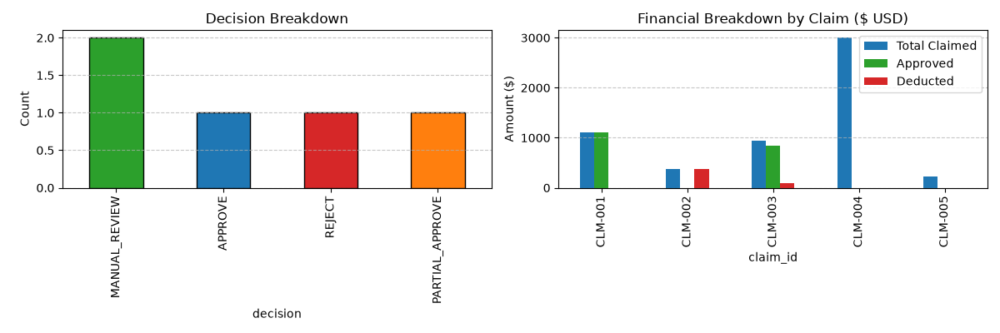

# HCL Claim Analysis Agent

A agent for reviewing employee travel reimbursement claims against a travel policy. It retrieves policy sections from a local Chroma vector store, checks expense limits and submission dates, and returns a structured decision with amounts, missing documents, policy references, and an explanation.

## What It Checks

- Eligible and ineligible expense categories
- Meal, lodging, and ground-transport daily limits
- Receipt requirements for individual expenses
- Approval thresholds and manual-review conditions
- Claim submission timing

The policy text, agent tools, evaluation workflow, five sample claims, and dashboard are in [`agent.ipynb`](agent.ipynb).

## Requirements

- Python 3.10 or later
- An OpenAI API key with access to `gpt-4o-mini` and `text-embedding-3-small`
- The dependencies listed in [`requirements.txt`](requirements.txt)
- VS Code with the Jupyter extension, or another Jupyter environment

## Setup

1. Create and activate a virtual environment

2. Install the project dependencies:

3. Create a local environment file and add your API key:

	Set `OPENAI_API_KEY` in `.env`.

4. Open `agent.ipynb` and run the cells from top to bottom. The notebook creates or loads the persistent Chroma data in `chroma_policy_db/`, evaluates the sample claims, and displays a results dashboard.

## Sample Claim

The notebook includes this synthetic example of a lodging claim that exceeds the policy cap:

```json
{
  "claim_id": "CLM-003",
  "employee": "C. Nakamura",
  "trip_dates": "2026-06-08 to 2026-06-10",
  "submitted_date": "2026-06-22",
  "purpose": "Client site visit (business)",
  "total_claimed": 940.00,
  "items": [
	 {"category": "airfare", "description": "Round-trip economy airfare", "amount": 300.00, "receipt": true},
	 {"category": "lodging", "description": "Hotel, 2 nights @ $250", "amount": 500.00, "receipt": true, "units": 2},
	 {"category": "meals", "description": "Meals, 2 days @ $70/day", "amount": 140.00, "receipt": true, "units": 2}
  ]
}
```

### Example `claim_result` for CLM-003

The lodging limit is $200 per night for two nights. The $500 lodging charge is therefore reduced by $100, leaving $840 approved across the claim.

```json
{
  "claim_id": "CLM-003",
  "decision": "PARTIAL_APPROVE",
  "total_claimed": 940.0,
  "approved_amount": 840.0,
  "deducted_amount": 100.0,
  "missing_docs": [],
  "policy_refs": [
    "POL-CAT-01",
    "POL-AIR-01",
    "POL-PD-02",
    "POL-PD-01",
    "POL-RCT-01",
    "POL-APR-02",
    "POL-TIME-01"
  ],
  "confidence": 0.99,
  "explanation": "The lodging cap is $200 per night for two nights ($400 allowed), so $100 is deducted from the $500 lodging charge. The remaining $840 is within the manager approval tier.",
  "tools_used": [
    "lookup_travel_policy",
    "audit_expense_limits",
    "check_submission_timeline"
  ]
}
```

## Sample Outcomes

These illustrative outcomes correspond to the five claims included in the notebook. LLM-generated explanations and policy-reference lists may vary between runs.

| Claim | Scenario | Decision | Claimed | Approved | Deducted | policy_refs |
| --- | --- | --- | ---: | ---: | ---: | --- |
| CLM-001 | Compliant conference expenses | APPROVE | $1,110 | $1,110 | $0 | `POL-CAT-01`, `POL-PD-01`, `POL-PD-02`, `POL-APR-02` |
| CLM-002 | Spa and minibar expenses | REJECT | $380 | $0 | $380 | `POL-CAT-02` |
| CLM-003 | Lodging exceeds nightly cap by $100 | PARTIAL_APPROVE | $940 | $840 | $100 | `POL-PD-02`, `POL-APR-02` |
| CLM-004 | Business-class airfare, missing receipt, and amount over $2,000 | MANUAL_REVIEW | $3,000 | $0 | $0 | `POL-AIR-01`, `POL-RCT-02`, `POL-APR-03` |
| CLM-005 | Meal claim missing a required receipt | MANUAL_REVIEW | $220 | $0 | $0 | `POL-RCT-02` |


For manual-review cases, the notebook's decision instructions set the approved and deducted amounts to zero pending review; they are not final reimbursement amounts.

## Dashboard

The notebook generates a decision-count chart and a claimed-versus-approved-versus-deducted amount chart. The included screenshot is shown below.


